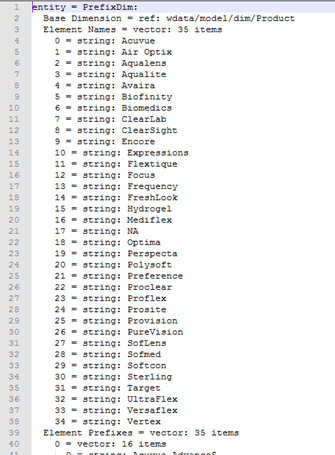

# Instellingen van afgeleide Dimension{#derived-dimensions-setup}

{{eol}}

De verschillende types van Afgeleide (Kant van de Cliënt) Dimension en hoe te om die in Data Workbench te plaatsen.

## Typen afgeleide Dimension {#section-33e6dcc9ab9745de9b830cecb2427ca3}

**Metrische Dimension**

Met Metrische Dimension kunt u metrische tellingen groeperen op een specifiek niveau. Het staat u ook toe om metrische tellingen door een specifiek niveau te groeperen. Zodra, wordt een Metrische Dimension gecreeerd, kunt u gegevens segmenteren die op de metrische waarde worden gebaseerd.

Voorbeeld 1: U bent een reisbedrijf en u wilt het verschil begrijpen van gedragsactiviteiten op de website tussen uw frequente vliegers en klanten die minder dan vijf keer een vlucht hebben geboekt.

Al u hebt tellen van Boeken als metrisch, hoe u klanten segmenteert die op metrisch - hier, boeken - worden gebaseerd om hun gedrag op de website te begrijpen?

Voorbeeld 2: U bent een Financiële Bank en u wilt uw klanten groeperen die op aantal CDs worden gebaseerd zij in hebben geïnvesteerd. U wilt uw klanten in 3 Tiers segmenteren. Niveau 1 - Klanten met meer dan 10 cd&#39;s, niveau 2 - Klanten met meer dan 5 en minder dan 10 cd&#39;s en niveau 3 - Klanten met meer dan 0 en minder dan 5 cd&#39;s

De informatie u hebt metrisch is die u tellingen van CD investeringen - hoe u de Verband Segmenten van de Klant voor uw analyse zult creëren?

*Metrische Dimension maken - via Workstation*

Merk één van de metrische afmetingen OOB als lokaal en noem die afmeting met een douanenaam anders / maak lokale exemplaar van RenameDim.example en verander het in de juiste afmetingsnaam met .dim uitbreiding

Open de nieuwe dimensie in het werkstation om wijzigingen aan te brengen. Wijzig de volgende parameters van de metrische dimensie op basis van de vereisten: 

Metrisch - Te groeperen metrisch

Niveau - Niveau waarop de metriek zal worden gegroepeerd

Begin emmertje - Beginelement van de metrische Dimension. Voer dezelfde waarde in voor de verschuiving.

Grootte emmertje - Grootte van metrisch groeperen. Dezelfde waarde op schaal invoeren

Aantal emmertjes - Maximum aantal elementen dat in de afmeting moet worden getoond

Sla de nieuwe dimensie op de server op als u deze met anderen wilt delen.

**Dimension voorvoegsel**

Het belangrijkste doel van de dimensie Prefix is elementen van de originele afmeting te groeperen en gebruikersvriendelijke namen aan de gegroepeerde elementen te verstrekken.

U hebt bijvoorbeeld een detailhandelssite en uw site heeft verschillende sitesecties, zoals dameskleding, dameskleding, speelgoed en games, Home Decor, enzovoort. Elk van deze sitesecties heeft verschillende pagina&#39;s. U wilt weganalyse doen en inzichten over het verkeer krijgen dat van één plaatssectie aan andere gaat etc. Als u de afmeting van URI gebruikt, zult u elke pagina van elk van de plaatssectie in Browser van de Weg of de Kaart van het Proces moeten trekken en de analyse voortzetten.

Dezelfde analyse kan eenvoudig worden uitgevoerd als er een voorvoegsel is met pagina&#39;s van een sitesectie die als één element zijn gegroepeerd.

Voorvoegsel Dimension maken:

Open een 2D-proceskaart vanuit het menu Visualisatie.

Wijzig de volgende parameters van de voorvoegselafmeting op basis van de vereisten.

De Dimension van de Kaart van de verandering - de Dimension die u voor 2D proceskaart wilt gebruiken (Ex: SMS-typologie)

Dimension op kaartniveau wijzigen - Niveau van de bovenstaande dimensie

De Dimension van de Clip van de Kaart van de verandering - het telbare niveau waarop u de gegevens wilt bekijken.

Metrisch van de Kaart van de verandering - metrisch die u wilt bekijken.

Zodra de 2D kaart van het Proces wordt geplaatst, open de afmeting die u in de parameter van de Dimension van de Kaart van de Verandering vermeldde.

Selecteer de elementen die u wilt groeperen. Gebruik CTRL+ALT en sleep de elementen naar de procesafbeelding.

Klik met de rechtermuisknop op de punt die wordt weergegeven en wijzig de naam van de groep. Als u 3 elementen hebt geselecteerd om te groeperen, zal de standaardnaam 3 Geselecteerd zijn.

Klik met de rechtermuisknop op de omtrek van de visualisatie en sla afmetingen op in het menu dat wordt weergegeven.

**Naam Dimension wijzigen**

De naam van Dimension wijzigen wordt gemaakt op basis van een reeds bestaande dimensie. Het belangrijkste doel van het hernoemen afmeting is gebruikersvriendelijke namen aan de elementen van de afmeting te verstrekken. De afmetingen voor Naam wijzigen buiten het vak zijn de pagina-afmetingen die zijn gemaakt van de URI-dimensie. De dimensie URI kan verwarrend zijn voor een persoon die geen technische namen van de pagina&#39;s kent en daarom staat de dimensie van de Pagina u toe om elementen van de afmeting van URI anders te noemen.

AANGEPASTE NIEUWE DIMENSION MAKEN:

Elementen van de hernoemde dimensie bevatten een een-op-een-toewijzing met de elementen van de oorspronkelijke basisdimensie. U kunt dit verifiëren door het .dim dossier van anders te openen Dimension in het werkstation/de stootkussen van de Nota. U zult merken dat elk element van de oorspronkelijke dimensie slechts één waarde (naam tekenreeks wijzigen) heeft in het bestand.

Als u minder elementen voor het anders genoemde doel hebt; u kunt een .dim dossier in het werkstation tot stand brengen en elke individuele elementen anders noemen door de hieronder verklaarde stappen.

Stappen om een .dim dossier voor te creëren anders noemen Dimension - Gebruikend het Werkstation

Gebruik deze optie als het aantal elementen waarvan de naam moet worden gewijzigd, kleiner is.

1. Open een lege werkruimte en open de Manager van Dimension. Klik met de rechtermuisknop op>Beheer>Profiel>Profielbeheer.
1. Vouw de map Dimension in de kolom Bestand uit.
1. Vouw de map Pagina in de bestandskolom uit en klik met de rechtermuisknop op het bestand Page.dim in de kolom Tweede naar laatste (in deze kolom wordt meestal de profielnaam weergegeven). Klik vervolgens op de optie Lokaal maken.
1. Klik met de rechtermuisknop op het bestand Page.dim in de kolom &quot;Gebruiker&quot; en klik op de optie Kopiëren en plak het gekopieerde .dim-bestand in de gewenste map onder de map Dimension.
1. Klik op OK in het foutbericht.
1. U ziet nu dat er twee Page.dim-bestanden zijn in de map Dimension. Eén is het oorspronkelijke bestand onder de map Dimension\Page en de tweede is het bestand dat u gewoon in stap 4 plakt.
1. Klik met de rechtermuisknop op het onlangs geplakte bestand Page.dim onder de kolom Gebruiker en klik op het invoervak blauw/grijs met de tekst Page.dim. Het invoervak wordt groen als de cursor knippert, wat aangeeft dat het kan worden gewijzigd. Typ de naam van de dimensie Naam wijzigen die u wilt maken.
1. Het bestand Page.dim in de kolom Bestand is gewijzigd in de nieuwe bestandsnaam die u in stap 7 hebt opgegeven. Klik met de rechtermuisknop op het bestand new.dim in de kolom Gebruiker (Laatste kolom) en selecteer Openen>In werkstation.
1. Zodra het .dim dossier in het werkstation wordt geopend; Klik op het plusteken (+) naast de entiteit en vouw deze uit. Waardeer de waarde die aanwezig is in het veld Bovenliggend. De waarde weerspiegelt de URI-dimensie. Er wordt &quot;wdata/model/dim/URI&quot; weergegeven. Klik op het invoervak blauw/grijs om de URI te wijzigen in de naam van de dimensie waarvan u de elementen wilt hernoemen.
1. Zorg ervoor dat de dimensie waarvan u de naam wilt wijzigen, wel bestaat in de gegevensset. Dimension-namen zijn hoofdlettergevoelig, zodat het hoofdlettergebruik van de oorspronkelijke dimensie behouden blijft.
1. Neem de &quot;gewijzigde&quot;verschijning naast de afmetingsnaam waar. Dit geeft aan dat de oorspronkelijke afmeting is gewijzigd. de in stap 9 aangebrachte wijzigingen te ondersteunen; Klik met de rechtermuisknop op new.dim (gewijzigd) en klik op de optie &quot;Opslaan als&quot;.
1. Als de dimensie eenmaal per stap 10 is opgeslagen, is de nieuwe naamgevingsdimensie voor de campagnes nu beschikbaar voor het wijzigen van de naam. Dit is alleen lokaal beschikbaar voor u.
1. Anderen kunnen alleen de door u gemaakte dimensie zien als deze in het profiel wordt opgeslagen. Klik met de rechtermuisknop op het .dim-bestand van de nieuwe dimensie in de kolom &quot;Gebruiker&quot; (Laatste kolom) en klik op &quot;Opslaan naar>Profielnaam&quot; waarin u de dimensie wilt opslaan.
1. Nadat u het bestand in het profiel hebt opgeslagen, kunnen alle gebruikers van het werkstation die toegang hebben tot dit profiel, zien welke afmetingen zijn gewijzigd voor de campagnes.

Voorvoegsel en naam van maker gedim wijzigen

Adobe heeft een gereedschap van Excel om Dimension voor voorvoegsels en hernoemen te genereren.

Hieronder vindt u de stappen waarmee u de afmetingen Voorvoegsel/Naam wijzigen kunt genereren met het gereedschap:

1. Het gereedschap Excel opslaan *Adobe_DWB_Dimension_Generator.xlsm* in een map. Neem contact op met de klantenservice van Adobe om het programma te downloaden.
1. Open het gereedschap en schakel macro&#39;s in: 

1. Vul het gegevensblad met de waarden die moeten worden gebruikt.

   We maken bijvoorbeeld een productmerkvoorvoegsel op basis van de Dimension van het product. In het gegevensblad wordt de volgende informatie vastgelegd: 

   Elk product wordt in het gegevensblad aan een merk toegewezen.

1. In het lusje van de Configuratie, vul de informatie met betrekking tot de te creëren afmeting. Voor de voorbeeldgegevens hierboven wordt informatie ingevoerd: 

   Naam: Naam voor de dimensie Voorvoegsel/Naam wijzigen

   Type: Voorvoegsel/naam wijzigen

   Bron grijs maken: Oorspronkelijke Dimension

   Kolom afstemmen: Te koppelen kolom

   Resultaatkolom: Waarde die voor nieuwe dimensie moet worden gebruikt.

1. Klik op de knop met de titel *Klik hier*. 

1. Het dimbestand wordt gegenereerd in dezelfde map als waarin het gereedschap is opgeslagen. 

   Sla het dimbestand op in de map Dimension met Profielbeheer.

**Dimension verschuiven**

De afmetingen van de verschuiving staan u toe om het Nde element van om het even welke afmeting bij binnen om het even welke bepaalde Trekbare Dimension te bekijken.

Ze geven u ook de mogelijkheid om terug te kijken naar het negende element van een dimensie binnen een bepaalde Countable Dimension

Voorbeeld 1:

* De negende pagina in een sessie - Volgende pagina Dimension
* De negende pagina voor een bezoeker - Volgende pagina voor bezoeker - over alle zittingen
* De negende oproep voor een gebruiker

Waarom is het belangrijk om het Nth-element van de aftelbare dimensie te kennen?

* U wilt weten welke 5e pagina tijdens een sessie is weergegeven.
* Wilt u pathingon Campaigns doen om te begrijpen welke tweede campagne werd bekeken na het bekijken van de campagne &quot;Free Checking Account&quot;?
* U wilt begrijpen welke verbindingsbezoeker alvorens &quot;Chat met een Agent&quot;verbinding klikte te klikken? 

De volgende URI is een van de OOB Shift-afmetingen die als sjabloon kunnen worden gebruikt. Het bovenstaande voorbeeld geeft u het tweede (Verschuiving = 1) element van de campagne (Dim = Campagne) in de Gebeurtenis van de Betrokkenheid (Clip = de Gebeurtenis van de Betrokkenheid)

Hier betekent verschuiving 1 betekent vooruit kijken naar rechts in de gebeurtenis

Andere OOB Shift-Dimension

*Volgende pagina:*

De volgende pagina die in een sessie wordt weergegeven nadat de pagina op dat moment is geselecteerd in het Dimension

Hier is de verschuiving 1, Niveau is Paginaweergave, Dim is Pagina en Clip is Sessie

*Vorige pagina:*

De vorige pagina die in een sessie is weergegeven vóór de huidige pagina in het Dimension van Pagina

Hier is de verschuiving -1, Niveau is de Paginaweergave, Dim is Pagina en Clip is Sessie

Wat wordt de vorige campagne vóór de geselecteerde campagne door een bezoeker weergegeven?

Hier is de compensatie -1, Niveau is de Reactie van de Campagne, Dim is de Waarde van het Attribuut van de Reactie van de Campagne en de Clip is Bezoeker

*Shift Dimension maken via werkstation*

* Een van de OOB-verschuivingsafmetingen als lokaal markeren
* De naam van die dimensie wijzigen met een aangepaste naam
* Nieuwe dimensie openen in het werkstation om wijzigingen aan te brengen
* Verandering volgende parameters van de metrische dimensie die op de vereisten worden gebaseerd.

   * Veelzijdige dimensie
   * Verschuiving - U wilt achterwaarts kijken
   * Dim -Dimension waarvan de elementen u wilt analyseren
   * Knip-telbaar in u wilt bekijken.

* Sla de nieuwe dimensie op de server op als u deze met anderen wilt delen.

**Laatste N Dimension**

De laatste Dimension van N werkt slechts op de Dimension van de Tijd en op het Eind van Tijd van het systeem. OOB-tijdafmetingen zijn Dag, Week, Uur en Maand. U kunt de dimensie Laatste N maken voor elk van deze basistijddimensies, zoals Afgelopen 10 dagen, Afgelopen 72 uur, Afgelopen 8 weken, Afgelopen 6 maanden, enzovoort. Laatste N Dimension berekent Laatste N op basis van de huidige &quot;Tijd Metrisch van het Rapport&quot;of vanaf Tijd van het systeem. 

Aantal - Totaal aantal elementen dat in de afmeting moet worden getoond

Verschuiving bereik - Verschuivingswaarde om het beginpunt (dag/week) aan te geven voor het berekenen van de laatste N-dag/week.

**None.dim**

None.dim is een Alias-dimensie. Het wordt gebruikt om alias van uitgebreide afmetingen tot stand te brengen.

Voorbeeld:

In None.dim wordt de entiteit gedefinieerd als &quot;wdata/model/dim/Parent/+name&quot; (kan worden gewijzigd), wat betekent dat de dimensie wordt gemaakt volgens de naam van het dimensiebestand. Als we dus een kopie van het bestand None.dim maken in de map Dimension (in dit voorbeeld het bestand None.dim kopiëren en hernoemen in de map Bezoekersprofiel) en de naam hiervan wijzigen in Log Source ID.dim, wordt een nieuwe afgeleide dimensie met Logbron-id weergegeven in het menu onder Bezoekersprofiel, zoals hieronder wordt getoond:

Voor wijzigingen: 

Na wijzigingen in None.dim: 

De entiteit kan in de uitgebreide dimensienaam worden veranderd, in dit geval een andere afmeting met een andere naam die aan de zelfde afmeting richt zoals hieronder getoond:

In dit voorbeeld heeft &quot;Source Name.dim&quot; de volgende inhoud: 

Zo zal een andere Van de Bron Dimension die aan Logbron identiteitskaart richt verschijnen. 

**Afgeleide Dimension verbergen**

Als u de Afgeleide Dimension wilt verbergen, stelt u de optie *Tonen* eigenschap aan &quot;false&quot;. 
