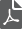

# Help bij Data Workbench{#data-workbench-help}

[Data ](https://www.adobe.com/solutions/digital-analytics/data-workbench.html) Workbenchis onderdeel van  [Adobe Analytics](https://www.adobe.com/solutions/digital-analytics.html). Het heeft hoogst-flexibele, krachtige, multi-kanaalmogelijkheden die worden ontworpen om gegevens van online en off-line klanteninteractie over alle soorten Web, CRM, POS, en andere gegevenstypes te verzamelen, te verwerken, te analyseren en te visualiseren. De interactieve rapporten in Data Workbench laten u analyseren en op relevante statistische informatie reageren om activiteit te controleren en klantentendensen te voorspellen.

*  [iconAnalytics Documentation](https://experienceleague.adobe.com/docs/analytics/landing/home.html)
*  [iconDownload All Data Workbench documentation in PDF](/help/home/assets/data-workbench.pdf)

## Belangrijke onderwerpen

Data Workbench bevat de volgende voorspellende analysefuncties, gegevensvisualisaties en rapporten:

* [Kenmerk best passend](/help/home/c-get-started/c-attribution-profiles/c-attrib-algorithmic/c-attrib-algorithmic.md)
* [Score volheid](/help/home/c-get-started/c-analysis-vis/c-visitor-propensity/c-visitor-propensity.md)
* [Beslissingsbomen](/help/home/c-get-started/c-analysis-vis/c-decision-trees/c-decision-trees.md)
* [Correlatiematrix](/help/home/c-get-started/c-analysis-vis/c-correlation-analysis/c-correlation-analysis.md)
* [Clustering](/help/home/c-get-started/c-analysis-vis/c-visitor-cluster/c-visitor-cluster.md)
* [Visualisatie kord](/help/home/c-get-started/c-analysis-vis/c-chord-visualization.md)
* [Attributieprofiel](/help/home/c-get-started/c-attribution-profiles/c-rules-attrib/c-rules-attrib.md)
* [Master marketingprofiel exporteren en integreren](/help/home/c-get-started/c-exp-data-seg-exp/c-mmp-integration.md)

## Meer Analytics-gebruikershandleidingen

[Analytics-gebruikershandleidingen](https://experienceleague.adobe.com/docs/analytics/landing/home.html)

## Opmerkingen bij de release Data Workbench en nieuwe functies

[Data Workbench 6.6.1 ](/help/home/c-release-notes-insight/c-6-6-1.md) wordt nu vrijgegeven. Dit omvat updates van de MMP-configuratie voor het splitsen van recordbestanden.

[Data Workbench 6.6](/help/home/c-release-notes-insight/c-6-6.md) wordt nu vrijgegeven. Het omvat updates aan de Score van de Volheid en een nieuwe Tovenaar van de Uitvoer van het Segment.

[Data Workbench 6.52 ](/help/home/c-release-notes-insight/c-6-52.md) wordt vrijgegeven. Deze bevat een AVRO-upgrade voor het verwerken van gegevensbronlogbestanden.

[Data Workbench 6.51 ](/help/home/c-release-notes-insight/c-6-51.md) wordt vrijgegeven. Het bevat een nieuwe AVRO Feed- en verloopbedekkingen voor de staafgrafiek.

[Data Workbench 6.5 ](/help/home/c-release-notes-insight/c-6-5.md) wordt vrijgegeven. Installeer de nieuwste versie van Data Workbench met nieuwe functies, waaronder:

* [Associations ](/help/home/c-get-started/c-analysis-vis/associations-visualization.md) Table and  [Associations ](/help/home/c-get-started/c-analysis-vis/associations-chord.md) Chordvisualizations.
* [Optie ](/help/home/c-get-started/c-analysis-vis/c-decision-trees/c-decision-trees-regression.md) voor de regressiestructuur en andere updates voor Beslissingsbomen.

[Data Workbench 6.4 ](/help/home/c-release-notes-insight/c-6-4/c-6-4.md) omvat:

* [Exporteren naar Analytics Core Services](/help/home/c-release-notes-insight/c-6-4/dwb-crs-integration.md)
* [Wizard Werkstation instellen](/help/home/c-install-insight/install-setup/dwb-client-installer.md)
* [Presentatielaag voor het notiteren van visualisaties](/help/home/c-get-started/c-vis/c-present-layer.md)
* [wizard Metrische grijswaarden](/help/home/c-get-started/c-vis/dwb-create-metricdim/dwb-create-metricdim.md)

*Laatst bijgewerkt*:  **30-09-2019**
