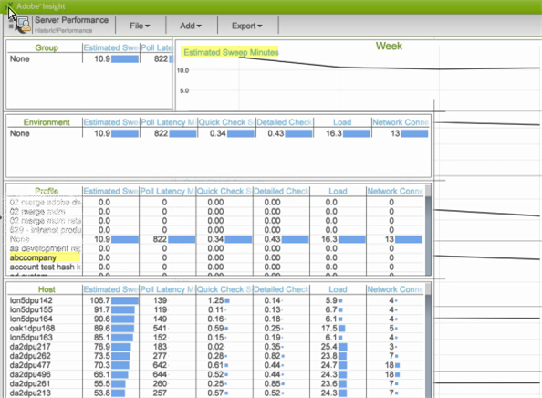

# Historisch Data Workbench-werkruimte{#data-workbench-historic-workspace}

Gebruik het historisch profiel van de gegevenswerkbank om te zien hoe configuratie, hardware, en andere veranderingen prestaties, stabiliteit, en servercapaciteit in tijd beïnvloeden.

Het historische profiel bevat een profielgebaseerde [Profile Performance](../../../home/monitoring-installation/monitoring-profiles/monitoring-historical-using.md#section-184a86f9de054970bf68515bb9dea85d) dataset en de servergebaseerde [Server Performance](../../../home/monitoring-installation/monitoring-profiles/monitoring-historical-using.md#section-5dad5870384b40e094d50173fcd90a09) dataset onder het tabblad **[!UICONTROL Performance]**. Dit zijn de het meest algemeen gebruikte datasets die voor een verleden perspectief van de prestaties van de gegevenswerkbankserver worden bekeken. Daarnaast kunt u de [Componenten](../../../home/monitoring-installation/monitoring-profiles/monitoring-historical-using.md#section-5be7223abb384784bafe7b37c764ea66) en [Verwerkingsmodus](../../../home/monitoring-installation/monitoring-profiles/monitoring-historical-using.md#section-5be7223abb384784bafe7b37c764ea66) weergeven door het tabblad **[!UICONTROL Up Time]** te selecteren.

Daarnaast kunt u de [Componenten](../../../home/monitoring-installation/monitoring-profiles/monitoring-historical-using.md#section-5be7223abb384784bafe7b37c764ea66) en [Verwerkingsmodus](../../../home/monitoring-installation/monitoring-profiles/monitoring-historical-using.md#section-5be7223abb384784bafe7b37c764ea66) weergeven door het tabblad **[!UICONTROL Up Time]** te selecteren.

Zie [Dimension in het historisch profiel van het Inzicht](../../../home/monitoring-installation/monitoring-appendix/monitoring-historical.md#concept-a42837c9c9274f83ad5bc5a6720f02b0) voor aanvullende referentiegegevens over de afmetingen die worden gebruikt in het historisch profiel van de gegevenswerkbank.

## Werkruimte voor profielprestaties {#section-184a86f9de054970bf68515bb9dea85d}

Deze dataset omvat de volgende relevante metriek voor de controle van de gegevenswerkbank.

* Snelle input MegaBytes per minuut-metriek die zware gegevensinput tijdens aanvankelijke logboekverwerking tonen.
* Snel MegaBytes samenvoegen per minuut - maateenheden die transformatie weergeven.

>[!NOTE]
>
>Als u een echte prestatiebeoordeling van uw profiel wilt uitvoeren, bekijkt u de snelheid in plaats van de verstreken kalendertijd. De snelheid wordt gemeten als de gewijzigde waarden tussen de opiniepeiling om de tien minuten.

## Werkruimte Serverprestaties {#section-5dad5870384b40e094d50173fcd90a09}

Deze dataset controleert servermetriek voorbij het werkingsgebied van inbegrepen profielen, en omvat de volgende relevante servermetriek voor gegevenswerkbench controle.

* Geschatte duur van controleminuten — Geschatte tijd voor queryresolutie.
* Milliseconden van de Latentie van de opiniepeiling — Indicator van hoe bezige software is door te meten hoe lang het duurt om door een volledige cyclus van het onderhouden van elke component te krijgen.

## Componentwerkruimte {#section-5be7223abb384784bafe7b37c764ea66}

Deze dataset wordt gevestigd onder de Up Tijd tabel.

De dataset van Componenten omvat twee aspecten voor componentengezondheid:

* Communicatie metrisch — beantwoordde het proces van de gegevenswerkbankserver?
* Alle metrische componenten — Bovenaan de Gedetailleerde pagina van de Status is een lijst van componenten de gastheer binnen de processen van de gegevenswerkbankserver onderhoudt. Als een component zich in een foutstatus bevindt, wordt deze weergegeven onder Componenten in de tabel Error.

## Werkruimte voor verwerkingsmodus {#section-3e1dedb9474e4b4ba513240943e76817}

Deze werkruimte bevindt zich onder het tabblad Up Time. In deze werkruimte kunt u zien hoeveel tijd er wordt besteed in de modus Snel invoeren, Snel samenvoegen en In real-time.

Deze dataset verstrekt belangrijke eigenschappen van de serverlading, zoals het identificeren van gegevenslading voor

* Dag van de week (bijvoorbeeld een snelle Invoersnelheid op dinsdag en woensdag),
* Uur van Dag (welk percentage van de dag is het op Snelle wijze van de Input?)
